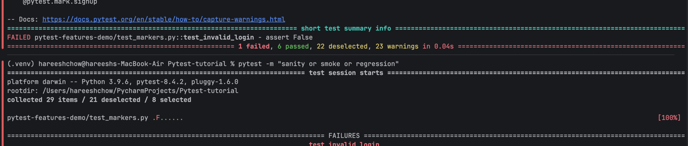
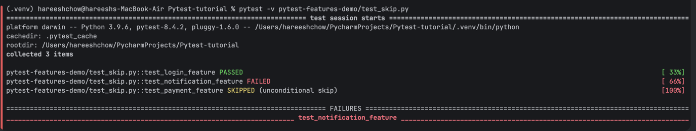
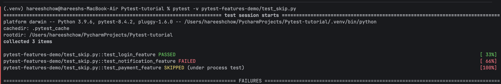
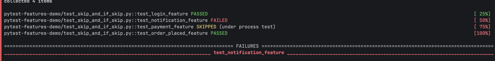
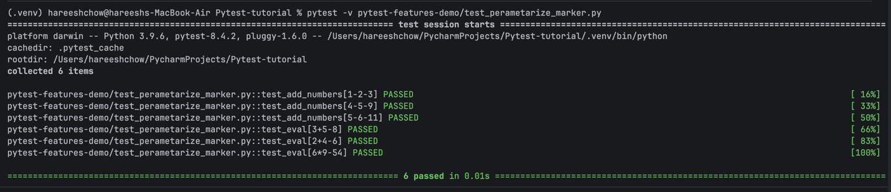

# note -

### to run specific test cases on folder level -  
* pytest pytest-features-demo/test_running_steps.py

### To run specific test file - 
* pytest pytest-features-demo/test_running_steps.py::test_login

### run the test using keyword - 
* pytest -k "even"

### run in verbose mode (Detailed)- 
* pytest -v pytest-features-demo/test_sample.py

### To run the last failed testcases
* pytest --lf

# markers - used to group the test cases (very useful to group as features)
* pytest -m "sanity or smoke or regression"

skip marker - used to skip unconditionally - should be used on incomplete tests
* @pytest.mark.skip

* @pytest.mark.skip(reason='what ever')

* skip if - used for to run with some condition cases
* @pytest.mark.skipif(True, reason='under process test')
* 

# perametarization - used to test multiple inputs into single test
@pytest.mark.parametrize("test_input,expected", [("3+5", 8), ("2+4", 6), ("6*9", 54)])

# Xfail - 